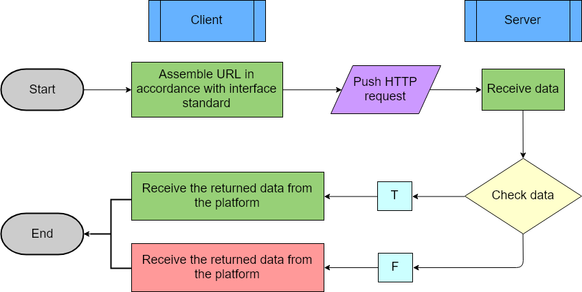
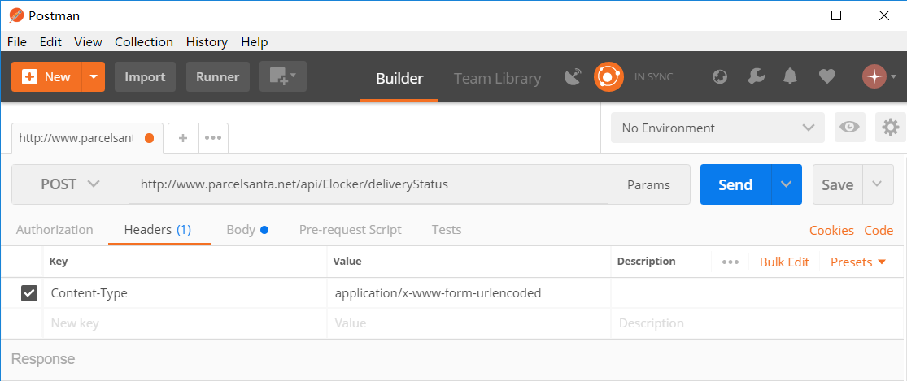
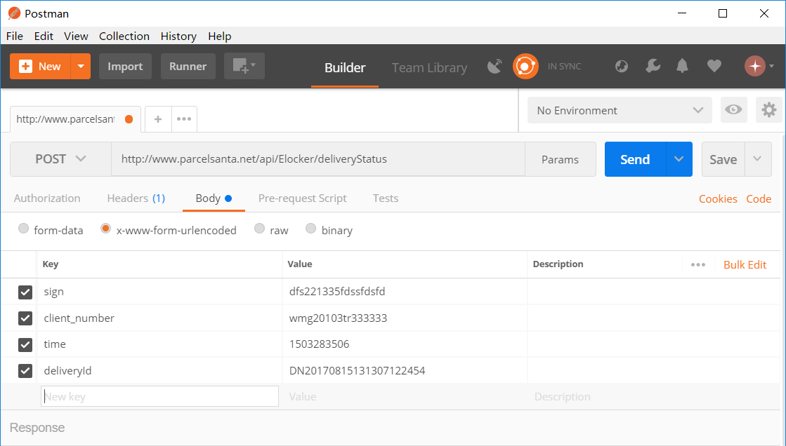
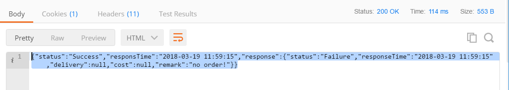

# Get started

## Things to achieve using API
API stands for Application Programming Interface. It is an interface that makes the software front-end communicate with back-end using standardized HTTP requests and responses. 

It is important to know how API works, as it is an indispensable tool for software applications to achieve a full spectrum of functionalities. Each interaction between the user and the software front-end will automatically send an HTTP request to the back-end. Depending on the data in the request, the back-end will return a response to front-end. The response will be presented on the front-end interface in a way that is easy to understand. The user may take actions based on what is presented, and probably start another interaction with the front-end. In short, any button that the user clicks on the front-end interface will trigger an API request and receive a response, and API enables seamless integration between software front-end and back-end. 

From a user's perspective, API is working invisibly behind the scene to make all these things happen, and one interaction takes an unnoticeable time period in milliseconds. 

Technical users can follow the syntax and assemble requests like building blocks. Using these requests, technical users can get responses from back-end without relying on the front-end interface. If you are keen on technical details, this guide will walk you through the process to get familiar with Parcel Santa API solution.

## Know the fundamentals
If you take a closer look at an API request, you will notice it consists of several things: 

- **URL:** Choose the correct URL for corresponding task. Different requests have different endpoints, which are at the ending part of the URL. 
- **Method:** The most frequently used methods include POST and GET. Follow the API syntax to choose the correct method. 
- **Header:** This provides the Content-Type information of the request. 
- **Body:** This provides the parameters and values that the client wants to send to server.
For more details about how to create your own API request step by step, please refer to **Chapter 2. Assemble API requests and get responses**.

## Know the interface specification
### Introduction to API calls
You should assemble a valid URL in accordance with the API specification and request via HTTP GET or POST to get the data that you need. The schematic diagram is in the following:

**Note:** Parcel Santa is using RESTful API. You can simply assemble the required parameters into HTTP requests and then call them. Therefore, the programming languages that support HTTP protocol requests can call API, such as PHP, C#, ASP, Java and so on.
 

### API call entry
The call entry, which is also called the API interface, accesses the address. Corresponding AppKey, AppSecret and other parameters are also different.
URL: http://www.parcelsanta.net/api/Elocker/

### API call parameters
| Serial Number |       Name    |  Type  | Whether Necessary |       Description                  |
| :----------- | :------------ | :----- | :---------------- | :--------------------------------- |
| 1             | sign          | String | Necessary         | Autograph Md5 (time.sn)            | 
| 2             | client_number | String | Necessary         | Client ID assigned by Parcel Santa |
| 3             | time          | String | Necessary         | Timestamp                          |

### Protocol and transfer format
- The interface adopts HTTP protocol call. 
- The transfer format is Json. 

## References
For more information about parameter definitions, please refer to Singapore TR46 Standard issued by Spring.

## Style conventions
This guide is based on the following style conventions. Examples are provided for better understanding:

**Bold** font indicates actionable text that you can click and interact with:
“Click **Next** to proceed.”

`Monospace` font indicates inline code characters:
“The Content-Type should be `application/x-www-form-urlencoded`.”

Double curly brackets {{   }} indicate this is a parameter value. 

Curly brackets {  } indicate this is an individual object.

Square brackets [  ] indicate this is an array.

The following indicates this is a Json response:

```json
{
"status": "Success",
"responsTime": "2017-08-15 13:45:23",
"response": {
            "responseTime": "2017-08-15 13:45:23",
            "data":[ {
                    "device_number ": "2865624392",
                    "online": true,
                    " smallBox ": 5,
                    " mediumBox ": 2,
                    " largeBox ": 5,
                    },{
                    "device_number ": "3005624392",
                    "online": true,
                    " smallBox ": 5,
                    " mediumBox ": 2,
                    " largeBox ": 5,
                    },
                    ],
            "remark": ""
            }
} 
```

# Authentication***

> To authorize, use this code:

```ruby
require 'kittn'

api = Kittn::APIClient.authorize!('meowmeowmeow')
```

```python
import kittn

api = kittn.authorize('meowmeowmeow')
```

```shell
# With shell, you can just pass the correct header with each request
curl "api_endpoint_here"
  -H "Authorization: meowmeowmeow"
```

```javascript
const kittn = require('kittn');

let api = kittn.authorize('meowmeowmeow');
```

> Make sure to replace `meowmeowmeow` with your API key.

Kittn uses API keys to allow access to the API. You can register a new Kittn API key at our [developer portal](http://example.com/developers).

Kittn expects for the API key to be included in all API requests to the server in a header that looks like the following:

`Authorization: meowmeowmeow`

<aside class="notice">
You must replace <code>meowmeowmeow</code> with your personal API key.
</aside>


# Assemble API requests and get responses 
## Recommended tool 
It is recommended to download and install Postman desktop app from its official website:
https://www.getpostman.com/
Screenshots in this chapter are taken from Postman for demonstration purpose.

## Encoding rules 
All requests and response data are encoded in `utf-8` format, and all parameter values in URL should be encoded in `urlencode`.

If the requested Content-Type is `application/x-www-from-urlencoded`, all parameters values in the HTTP body should also be encoded in `urlencode`.

If the format is `multipart/form-data`, parameter value of each form field does not need to be encoded, but the charset portion of each form field needs to be specified for `utf-8`.

## Use the correct URL 
To create a valid API request, first thing you have to do is use the correct URL.

Look at one example of API POST request, which helps the user enquire a delivery order's status: 

http://www.parcelsanta.net/api/Elocker/deliveryStatus?sign=dfs221335fdssfdsfd&client_number=wmg20103tr333333&time=1503283506&deliveryId=DN20170815131307122454

The URL in this request is: 

http://www.parcelsanta.net/api/Elocker/deliveryStatus

If you wish to create a request to perform a similar task, you should use the URL above.

## Choose the method 
It is recommended to use GET method for open information query class API.

It is also recommended to use POST method for API of transactions such as privacy information, query and modification classes.

As shown in the previous example, the API request to enquire a delivery order's status is using POST method. 

If you wish to create a request to do the same thing, make sure you use the same URL and same method. 

## Fill information into Header 
Take the API request from **Section 2.3 Use the correct URL** as an example. 

In Postman, after you choose the **POST** method, copy the URL and paste it into the text field near **POST**. 

On the **Headers** tab, fill in the following information:

| Key                | Value                       | 
| :----------------- | :-------------------------- |
| Content-Type | application/x-www-form-urlencoded |

 

## Pair keys and values in the Body 
In Postman, open the **Body** tab. Select the **x-www-form-urlencoded** option. 

As the URL in API request is followed by parameters and values in pairs, fill in the following information: 

| Key                | Value                       | 
| :----------------- | :-------------------------- |
| sign				 | dfs221335fdssfdsfd		   |
| client_number		 | wmg20103tr333333			   |
| time				 | 1503283506				   |
| deliveryId		 | DN20170815131307122454	   |

 

## Send the API request  
In Postman, after you choose the method, fill information into Header, and pair keys and values in the Body, click **Send**. 

## Receive the response 
In Postman, after clicking **Send**, you will receive a response to your request. 

 


# Use API to fulfill functionalities

## Overview
API helps software application achieve functionalities by transferring data in the form of parameters between front-end and back-end. Once you are familiar with these parameters, you can assemble your own API requests to perform certain tasks. 

Parcel Santa RESTful API POST requests include the same beginning in the URL: 
**http://www.parcelsanta.net/api/Elocker/{{Endpoint}}**

Different POST requests include different endpoints: 

| Method | URL | Endpoint | Task |
| :----- | :-- | :------- | :--- |
| POST | http://www.parcelsanta.net/api/Elocker/deliveryCreate | /deliveryCreate | Create a delivery order |
| POST | http://www.parcelsanta.net/api/Elocker/deliveryStatus | /deliveryStatus | Enquire a delivery order's status |
| POST | http://www.parcelsanta.net/api/Elocker/deliveryCancel | /deliveryCancel | Cancel a delivery order |
| POST | http://www.parcelsanta.net/api/Elocker/lockerStatus | /lockerStatus | Retrieve locker status |

There are a few GET requests that look slightly different from POST requests: 

| Method | URL | Endpoint | Task |
| :----- | :-- | :------- | :--- |
| GET | http://www.parcelsanta.net:1218/ | Not Applicable | Obtain updated information of an order's status |
| GET | http://www.parcelsanta.net/api/Elocker/stoplistzip | /stoplistzip | Get a list of unit numbers that have declined service by zip code |

## Order creation API
### Matching functionality
The order creation API is used for submitting a delivery order to Parcel Santa system. This will transfer parcel-related data over to the system. Actual usage fee may be incurred upon deposit. 

### HTTP URL
`POST http://www.parcelsanta.net/api/Elocker/deliveryCreate`

### URL Parameters
You need to assemble the following parameters in the request.

| Serial Number | Parameter Name | Value Type | Whether Necessary | Description |
| :----- | :-- | :------- | :--- | :---------- |
| 1 | sign | string | Necessary | Autograph Md5 (time.sn) |
| 2 | client_number | string | Necessary | Client ID |
| 3 | time | string | Necessary | Unix timestamp, accurate to a second |
| 4 | data | string | Necessary | Create order initialization data, Json format. For data content, see "Content description of data parameters" |

Connect the URL and the first parameter with "?". 
Specify the value of each parameter immediately after "=". 
Connect each pair of parameter and value with "&". 
Sequence of parameters does not matter. 
For example, 
http://www.parcelsanta.net/api/Elocker/deliveryStatus?sign=dfs221335fdssfdsfd&client_number=wmg20103tr333333&time=1503283506&deliveryId=DN20170815131307122454

### Content description of data parameters
When couriers start a new deposit at the front-end, an order will be automatically created, and their input will become parameter values in an array called Orders. 

The Orders is a template. It is allowed to submit multiple Orders at one time.

The value of data is in Json, and Json only has one Key-Value Pair (KVP), which is named as "Orders". The data value of Orders is array, and each array is an order. 

The following is a detailed explanation of Orders. 

| Serial Number | Key Name | Value Type | Length | Whether Necessary | Description |
| :----- | :------- | :--------- | :----- | :---- | :---------|
| 0 | accountNo | String | 64 | Necessary | Courier company ID |
| 1 | eOrderId | String | 64 | Optional | Order ID of e-commerce platforms |
| 2 | trackingNumber | String | 64 | Necessary | Tracking ID in courier company's system, must be unique in courier's system |
| 3 | PaymentInfo | Json |  | Optional | Payment information. Value is Json |
| 3.1 | PayType | String | 24 | Optional | Payment type, e.g. Cash on Delivery, Tax and Duty |
| 3.2 | Currency | String | 12 | Optional | Currency values, such as: SGD |
| 3.3 | Amount | String | 7,3 | Optional | Amount to be paid. Default: 0 (Max: Seven-digit integer, three decimal places) |
| 4 | sender | Json |  | Optional | Sender information, the value is Json |
| 4.1 | contactName | String | 128 | Optional | Sender's name |
| 4.2 | contactNumber | String | 25 | Optional | Phone of sender, in format of 65XXXXXXXX |
| 4.3 | companyName | String | 128 | Optional | Company's name of senders |
| 4.4 | contactEmail | String | 64 | Optional | Sender email address |
| 4.5 | location | Json |  | Optional | Sender address information, the value is Json |
| 4.5.1 | address | String | 255 | Optional | Sender address | 
| 4.5.2 | address2 | String | 255 | Optional | Sender floor-unit number |
| 4.5.3 | city | String | 35 | Optional | The city of sender | 
| 4.5.4 | countryCode | String | 2 | Optional | Country code of sender, such as SG for Singapore | 
| 4.5.5 | postal Code | String | 9 | Optional | Sender zip code | 
| 5 | receiver | Json | | Necessary | Recipient's information. Value is Json | 
| 5.1 | contactName | String | 128 | Necessary | Recipient's name | 
| 5.2 | contactNumber | String | 25 | Necessary | Recipient's phone number |
| 5.3 | companyName | String | 128 | Optional | Recipient's company name | 
| 5.4 | contactEmail | String | 64 | Optional | Recipient's email address | 
| 5.5 | location | Json | | Necessary | Recipient's address information. Value is Json |
| 5.5.1 | address | String | 255 | Optional | Recipient's address | 
| 5.5.2 | address2 | String | 255 | Optional | Recipient's floor - unit number | 
| 5.5.3 | city | String | 35 | Optional | The city of recipient | 
| 5.5.4 | countryCode | String | 2 | Optional | Country code of recipient, such as SG for Singapore | 
| 5.5.5 | postalCode | String | 9 | Necessary | Recipient's zip code | 
| 6 | pickupTime | String | | Optional | DATE:(2015-08-20T11:00:00+08:00) |
| 7 | requestDateTime | String | | Optional | Use of insurance or value adding services, to specify the time and date of delivery | 
| 8 | parcels | Json | | Optional | Package | 
| 8.1 | description | String | 512 | Optional | Description of goods content |
| 8.2 | orderRemarks | String | 512 | Optional | Order note | 
| 8.3 | parcelsInfo | Json | | Optional | Package information | 
| 8.3.1 | length | String | 7,3 | Optional | Length (Max: Seven-digit integer, three decimal places) |
| 8.3.2 | height | String | 7,3 | Optional | Height (Max: Seven-digit integer, three decimal places) |
| 8.3.3 | width | String | 7,3 | Optional | Width (Max: Seven-digit integer, three decimal places) | 
| 8.3.4 | weight | String | 11,3 | Optional | Weight (Max: Eleven-digit integer, three decimal places) | 
| 8.3.5 | declaredCurrency | String | 3 | Optional | Declared currency (Such as USD, SGD, PHP) | 
| 8.3.6 | declaredValue | String | 16,2 | Optional | Declared value of goods (Max: Seven-digit integer, three decimal places) | 
| 9 | mechantInfo | Json |  | Optional | Online retailer's information | 
| 9.1 | eStoreId | String | 35 | Optional | Online store ID | 
| 9.2 | merchantId | String | 35 | Optional | Online retailer ID | 
| 10 | orderInfo | Json |  | Optional | Order information | 
| 10.1 | productIds | String | 30 | Optional | Goods ID | 
| 10.2 | orderQuantity | String | 8 | Optional | The quantity of the goods in these orders | 
| 10.3 | Commodity | String | 1 | Optional | Types of commodities | 
| 10.4 | processOrderDate | String |  | Optional | Process order date |
| 10.5 | insuredCurrency | String | 3 | Optional | Insured currency |
| 10.6 | insuredValue | String | 16,2 | Optional | Insured value | 
| 10.7 | gtin | String | 14 | Optional | Global trade item number | 

**Example of data value**


### Evaluate the response parameters
This table lists all the parameters included in the returned response.

| Serial Number | Name | Type | Max Length | Description |
| :----- | :----- | :------ | :--------- | :-------- |
| 1 | status | String | 35 | Status outcome (Success/Failure) | 
| 2 | responsTime | String |  | Response time | 
| 3 | msg | String | 512 | Error message when status value is "Failure" | 
| 4 | response | Json | | |
| 4.1 | status | String | 35 | Create the status of a delivery notification (Success/Failure) |
| 4.2 | responseTime | String | | Timestamp (Such as 2015-08-2-T11:00:00+08:00) | 4.3 | delivery | Json | | |
| 4.3.1 | eOrderId | String | 64 | e-business platform ID | 
| 4.3.2 | deliveryId | String | 35 | Created by E-lock | 
| 4.3.3 | quickReference | String | 10 | DHL order number | 
| 4.3.4 | trackingId | String | 35 | Courier number | 
| 4.4 | cost | Json | | Expense | 
| 4.4.1 | currency | String | 3 | The currency of the fees calculated based on the use of express locker this time (such as USD, SGD) | 
| 4.4.2 | value | String | 255 | The fees of the express locker this time | 
| 4.5 | remark | String | 512 | Description of request result. See the "Error case table" |


**Error case table**
This table lists all the parameters included in the returned error message.


| Serial Number | Parameter | Failure Reason | Remark Value |
| :----------- | :-------- | :------------- | :----------- |
| 1 | client_number | null | Request arguments {client_number} cannot be null! |
| 2 | data | null | Request arguments cannot be null! |
| 3 | accountNo | Can't find this value | 'accountNo:['.$accountNo.'],cannot be found! ' | 
| 4 | accountNo | null | accountNo is null! | 
| 5 | postalCode | null | postalCode is null | 
| 6 | receiver | null | receiver is null | 
| 7 | length/height/width | Exceed the maximum dimension for the largest locker | no suitable drawer! | 
| 10 | Other Exception | order submit exception | order create exception | 


### Return example
**Example 1**


**Example 2**


# Kittens***

## Get All Kittens

```ruby
require 'kittn'

api = Kittn::APIClient.authorize!('meowmeowmeow')
api.kittens.get
```

```python
import kittn

api = kittn.authorize('meowmeowmeow')
api.kittens.get()
```

```shell
curl "http://example.com/api/kittens"
  -H "Authorization: meowmeowmeow"
```

```javascript
const kittn = require('kittn');

let api = kittn.authorize('meowmeowmeow');
let kittens = api.kittens.get();
```

> The above command returns JSON structured like this:

```json
[
  {
    "id": 1,
    "name": "Fluffums",
    "breed": "calico",
    "fluffiness": 6,
    "cuteness": 7
  },
  {
    "id": 2,
    "name": "Max",
    "breed": "unknown",
    "fluffiness": 5,
    "cuteness": 10
  }
]
```

This endpoint retrieves all kittens.

### HTTP Request

`GET http://example.com/api/kittens`

### Query Parameters

Parameter | Default | Description
--------- | ------- | -----------
include_cats | false | If set to true, the result will also include cats.
available | true | If set to false, the result will include kittens that have already been adopted.

<aside class="success">
Remember — a happy kitten is an authenticated kitten!
</aside>

## Get a Specific Kitten

```ruby
require 'kittn'

api = Kittn::APIClient.authorize!('meowmeowmeow')
api.kittens.get(2)
```

```python
import kittn

api = kittn.authorize('meowmeowmeow')
api.kittens.get(2)
```

```shell
curl "http://example.com/api/kittens/2"
  -H "Authorization: meowmeowmeow"
```

```javascript
const kittn = require('kittn');

let api = kittn.authorize('meowmeowmeow');
let max = api.kittens.get(2);
```

> The above command returns JSON structured like this:

```json
{
  "id": 2,
  "name": "Max",
  "breed": "unknown",
  "fluffiness": 5,
  "cuteness": 10
}
```

This endpoint retrieves a specific kitten.

<aside class="warning">Inside HTML code blocks like this one, you can't use Markdown, so use <code>&lt;code&gt;</code> blocks to denote code.</aside>

### HTTP Request

`GET http://example.com/kittens/<ID>`

### URL Parameters

Parameter | Description
--------- | -----------
ID | The ID of the kitten to retrieve

## Delete a Specific Kitten

```ruby
require 'kittn'

api = Kittn::APIClient.authorize!('meowmeowmeow')
api.kittens.delete(2)
```

```python
import kittn

api = kittn.authorize('meowmeowmeow')
api.kittens.delete(2)
```

```shell
curl "http://example.com/api/kittens/2"
  -X DELETE
  -H "Authorization: meowmeowmeow"
```

```javascript
const kittn = require('kittn');

let api = kittn.authorize('meowmeowmeow');
let max = api.kittens.delete(2);
```

> The above command returns JSON structured like this:

```json
{
  "id": 2,
  "deleted" : ":("
}
```

This endpoint deletes a specific kitten.

### HTTP Request

`DELETE http://example.com/kittens/<ID>`

### URL Parameters

Parameter | Description
--------- | -----------
ID | The ID of the kitten to delete

